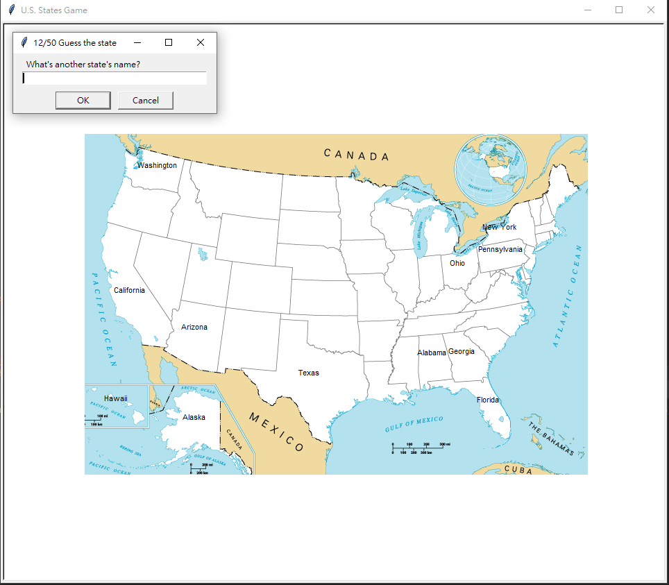

This project is the Day-25 course project of [100 Days of Code - The Complete Python Pro Bootcamp for 2021](https://www.udemy.com/course/100-days-of-code/) by Dr. Aangela Yu.

#### Here's the in-game screenshot:

#### Hidden function
*Exit* : In this version, by entering "exit", the programe would save a *states_to_learn.csv* file, so that user could exit the game and check on those stete not yet memorized.

#### Other notes
I had a lot of fun building this game. One thing is that I was really bad at geography, I only had some vague impression of those state names but never had a chance to locate them or to see all the 50 states. The other is by building this project, it hit on me that I could actully use all the concepts I learnt so far to create any useful tools/games like this to help myself learn any catogory of new things!

